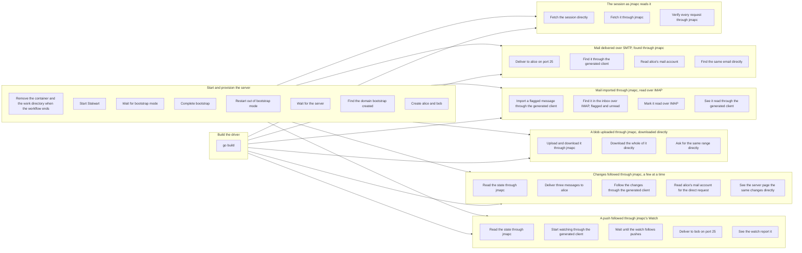

# Working on jmapc

Two commands cover most of the work on jmapc itself. The first runs the tests,
the second regenerates everything the catalogue produces, and both are what CI
runs first.

```
go test ./...        # everything that runs without a server
go generate ./...    # regenerate the runtime types and every example client
```

The example is generated three times, once per language, into `example/client`,
`example/rust/src/jmap_client` and `example/ts`. Go's tests cannot say whether the
other two compile, so CI runs `cargo fmt --check` and `cargo test` over the
Rust and `tsc --strict` over the TypeScript. Each of the two has a
hand-written check beside the generated code, exercising the runtime against a
stub: that the headers are sent, that authentication overrides them, that the
session is cached, and that a `/set` answering 200 with a refusal in it is
still an error.

The schema is checked the same way, and for the same reason: whether a
validator accepts the example requests and refuses the mistakes the schema
claims to catch is not something Go's tests can say. `example/schema/check.mjs`
runs one, over a schema written from the catalogue as it stands.

The generator is run from source here, not through `go tool`, because this is
the repository that defines it.

The tests above run the generated code against stubs, which answer the way
the tests expect a server to. `e2e/` runs it against a real one, Stalwart, in a
container. It is one [probe](https://github.com/linyows/probe) workflow, run
from the repository root:

```
probe e2e/workflow.yml
```

It needs docker, Go and probe 1.14.0 or later on the PATH. It starts the
container, takes Stalwart out of bootstrap mode, creates two accounts, builds
the driver, and runs the scenarios. Each scenario does
something through jmapc and checks it over a path that does not go through
jmapc: the session jmapc reads against the one fetched directly, a message
delivered over SMTP against what the generated client finds, a message imported
through jmapc against its flags over IMAP and a flag set over IMAP against what
jmapc reads, a blob uploaded through jmapc against the same blob downloaded
directly, changes followed through jmapc a few at a time against the server's
own paging of them, and a message delivered over SMTP against what reaches
jmapc's `Watch` by push, in an account where nothing else changes. The jmapc side is
`e2e/driver`, which calls the client generated from `e2e/requests` and prints
what came back as JSON.

The server is started and set up while the driver is built, and the scenarios,
which are independent of one another, then run in parallel:



`probe dag --mermaid e2e/workflow.yml` prints this graph; print it again after
adding a job or a step.

The first step starts a command in the background that removes the container
and the directory the driver is built in when it is stopped, and probe stops it
when the workflow ends, whether the scenarios passed, failed or were
interrupted. `E2E_KEEP=1` leaves both, and the passwords, generated for each run
otherwise, can be given as `E2E_ALICE_PASSWORD` and the like to log in
afterwards; the head of `e2e/workflow.yml` lists every setting. The Stalwart
release is pinned there too; a new minor version is a change made there on
purpose, since Stalwart moves its settings between them.

The runtime types and the example client are committed, and a test compares
them against what the catalogue produces now, so a change to the data model
that was not regenerated fails the build rather than going unnoticed. CI runs
the same checks, plus gofmt, go vet, and govulncheck.

A release is a tag pushed once the work is on main, and its notes are the
section of [CHANGELOG.md](https://github.com/linyows/jmapc/blob/main/CHANGELOG.md) for that tag: what changed, grouped by
what it means for the code that uses this, with the breaking changes first.
Write that section before the tag. A tag with no section fails the release
rather than publishing an empty one.

Write each entry on one line, however long it is. GitHub renders a release body
with the line breaks it was given, so a paragraph wrapped at 80 columns is a
paragraph broken at 80 columns on the release page.
