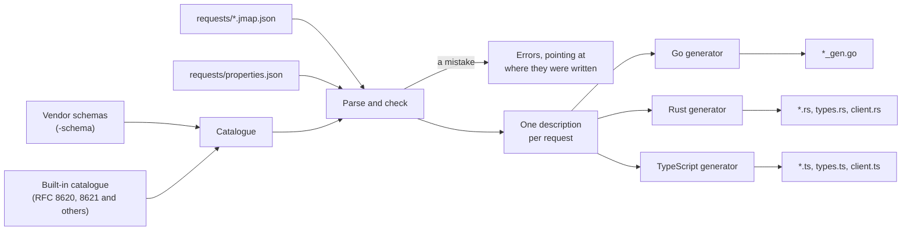
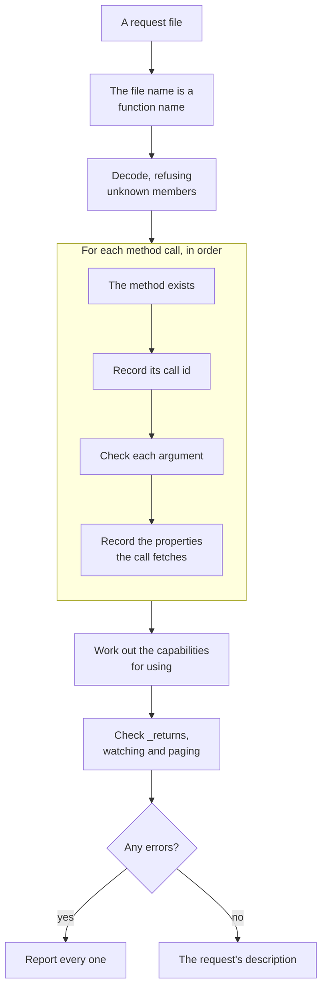
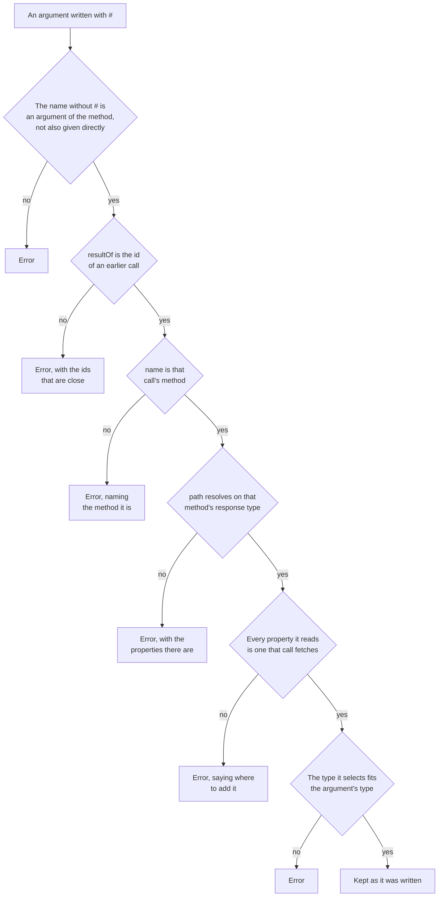

# How jmapc works

jmapc is a compiler in the way sqlc is one. Its source is the request files,
which it checks against the JMAP data model, and its output is a client in Go,
Rust or TypeScript. It works in three stages: the requests are parsed and
checked, what passed is held as one description per request, and a generator
for the chosen language writes the code from that description.

## The catalogue

The types and methods of the specifications jmapc knows are written into jmapc
itself, as Go data: Email and its properties, the arguments and response of
`Email/get`, which properties a filter condition takes, and so on. This is the
catalogue, and every check below is a question asked of it.

A [vendor schema](extensions.md) given with `-schema` adds its types and
methods to the same catalogue before any request is read. From then on there is
nothing to tell them apart from the standard ones, so a request against a
vendor's extension is checked exactly as one against Email is.

The runtime types of the Go package `github.com/linyows/jmapc` are generated
from the catalogue too, so the types a generated client decodes into and the
types the checks were made against cannot drift apart.

## Parsing and checking

Each request file is parsed on its own. The method calls are read in the order
they are written, and each is checked as it is read:

Checking an argument means finding it among the arguments the method takes and
checking its value against that argument's type, all the way down: a filter
against the conditions of the type being queried, a `PatchObject` against the
record it patches, `properties` against the properties of the data type. A
`{{name}}` in place of a value becomes a parameter of the generated function,
of the type the place it stands in requires, and a parameter used in two places
must have the same type in both. [Verification](verification.md) lists every check.

A mistake does not stop the file. Every error is collected, and reported with
the place it was written and, where there is one, a suggestion; the files are
all read before jmapc gives up, so one run reports the mistakes of every file.

### Back references

A back reference is an argument whose name starts with `#`, and its value is
taken from the result of an earlier call. What makes one correct is mostly the
values of three strings, and this is where checking a request against the
catalogue is most use:

"Earlier" needs no check of its own. A call's id is recorded as the call is
read, so when a reference is checked only the calls before it, and the call
it is in, have been recorded; a reference to its own call is refused
separately.

The path is a JSON Pointer, and it is resolved one token at a time on the
response type of the method named: a property name selects that property of an
object, a number selects an element of an array, and `*` applies the rest of
the path to every element and flattens one level of the result, so that
`/list/*/id` is a list of ids rather than a list of lists. The type at the end
is what the reference delivers, and it has to fit the type of the argument
it fills. That includes null: `/list/*/parentId` on `Mailbox/get` holds a null
for each mailbox at the top, so it cannot fill `ids`, whose elements are never
null. A property a method may return as null though its type says otherwise,
as `Email/parse` returns `threadId`, is read as nullable on that method's
response.

The data model alone does not catch everything. `/list/*/threadId` resolves on
the response of `Email/get`, since every Email has a `threadId`, but a call
whose `properties` asks only for the subject answers without it, and the
reference reads nothing. So each property the path selects on the records of
that call is held to the properties the call fetches as well. `id` passes
where the method returns it whether or not it was asked for, as a `/get` does.
A call that leaves its `properties` out fetches the method's default set: every
field of the type for most `/get` methods, though not a property beyond the
fields such as a header field, and a list of the method's own for `Blob/get`
(`data` and `size`) and `Email/parse`. A
property the method returns as null whatever it is asked for, as the id of a
parsed email, is refused however the call asks for its properties. The fetched
properties are known at this point, because the call the reference reads from
came earlier and was finished first.

What passes is written into the generated code unchanged, as a
`ResultReference` holding the same three strings. The server resolves it, and
the generated code does nothing with it at run time.

## The description of a request

What passes the checks is one description per request, which is all a
generator reads: the calls in order with their checked arguments, the
parameters and their types, the capabilities the request uses, the call whose
result is returned, the call a watch follows or a pager advances, the creation
ids, and the properties each call fetches.

Reading the request is done once, here, and the three generators share it.
What differs between Go, Rust and TypeScript is only how each of them writes
the same description out.

## Generating

Each request becomes one file, with a function named after the request, a type
for its parameters, and a type for the response holding the properties the
request asked for and no others. Where the request asks for one, the file also
carries a watch loop or a pager. Beside the request files go a file for the
[property sets](properties.md), if the project names any, and a function that
verifies every request against a server. Rust and TypeScript are written with
the data model types and the runtime as well, since they have no package of
jmapc's to import; Go imports `github.com/linyows/jmapc` for both.

Before writing anything, the generator refuses names that would collide: two
requests whose file names differ only in case, or a request named after a
property set or after the verification function.

`jmapc generate` writes the files into the output directory and removes the
files it generated earlier from requests that are no longer there. The other
commands run the same stages and stop short of writing:

| Command | Parse and check | Generate | Write |
|---|---|---|---|
| `jmapc generate` | yes | yes | yes |
| `jmapc generate -check` | yes | yes | no; compares with the files on disk |
| `jmapc validate` | yes | yes, in memory, to find colliding names | no |
| `jmapc validate -session` | yes | yes, in memory | no; checks each request against the server |

Checking against a server is the one step that does not ask the catalogue. It
fetches the session, and holds each request to what that server says it
accepts: the capabilities it advertises, the accounts it holds, and how many
calls and objects it takes in one request. These are left to the server by the
specifications, so the catalogue has nothing to say about them.
