# jmapcの開発

jmapc自体の作業は、ほとんどが2つのコマンドで足ります。
1つはテストを走らせ、もう1つはカタログから生成されるものを作り直します。
CIが最初に実行するのもこの2つです。

```
go test ./...        # サーバなしで動くものすべて
go generate ./...    # ランタイムの型と、全言語のサンプルクライアントを再生成する
```

サンプルは言語ごとに3度生成され、`example/client`、`example/rust/src/jmap_client`、`example/ts`に出力されます。
残る2つがコンパイルできるかどうかはGoのテストでは分からないので、CIはRustに`cargo fmt --check`と`cargo test`を、TypeScriptに`tsc --strict`を実行します。
どちらにも生成コードと並ぶ手書きの検査があり、スタブを相手にランタイムを動かします。
ヘッダが送られること、認証がそれに優先すること、セッションがキャッシュされること、そして200を返しながら拒否を含む`/set`がやはりエラーになることを確かめます。

スキーマも同じやり方で、同じ理由から検証します。
バリデータがexampleのリクエストを受け入れ、スキーマが捕まえると主張する間違いを拒むかどうかは、Goのテストには言えません。
`example/schema/check.mjs`が、その時点のカタログから書き出したスキーマに対してバリデータを実行します。

ここでジェネレータをソースから実行しているのは、このリポジトリがジェネレータの居場所だからです。

ここまでのテストは、生成コードをスタブに対して動かします。
スタブは、テストが期待するとおりにサーバとして応答するものです。
`e2e/`は、実際のサーバであるStalwartをコンテナで動かし、それに対して実行します。
全体が1つの[probe](https://github.com/linyows/probe)のワークフローで、リポジトリのルートで実行します。

```
probe e2e/workflow.yml
```

docker、Go、openssl、probe 1.14.0以降がPATHにある必要があります。
コンテナを起動し、Stalwartをbootstrap modeから抜けさせ、アカウントを3つ作り、ドライバーをビルドしてから、シナリオを実行します。
各シナリオは、jmapcを通して何かをしたあと、jmapcを通らない経路でそれを確かめます。
jmapcが読んだsessionを直接取得したものと比べ、SMTPで配送したメールを生成クライアントが見つけられるかを確かめます。
jmapcで取り込んだメールのフラグをIMAPで読み、IMAPで付けたフラグをjmapcで読みます。
jmapcでアップロードしたblobを、直接ダウンロードしたものと比べます。
jmapcで少しずつ追った変更を、サーバ自身の変更の分割と比べます。
SMTPで配送したメールが、pushでjmapcの`Watch`に届くかを、ほかに変更の起きないアカウントで確かめます。
StalwartがURLへ送るpushを`PushReceiver`が受け取るかも確かめ、購読があることと、終わったあとに消えていることを直接問い合わせて確かめます。
Stalwartはhttpsで、しかも名前で指定した宛先にしかpushを送らないので、このシナリオのためにワークフローは実行ごとにCAを作り、ドライバーがhttpsで使う証明書を発行します。
その名前は、コンテナの中からはホストに解決されます。
jmapc側を受け持つのは`e2e/driver`で、`e2e/requests`から生成したクライアントを呼び、結果をJSONで出力します。

サーバの起動と設定は、ドライバーのビルドと並行して行います。
その後、互いに独立したシナリオを並行して実行します。

```mermaid
flowchart LR
    subgraph server["Start and provision the server"]
        server_step0["Remove the container and the work directory when the workflow ends"]
        server_step1["Make a CA and a certificate for the push receiver"]
        server_step2["Start Stalwart"]
        server_step3["Wait for bootstrap mode"]
        server_step4["Complete bootstrap"]
        server_step5["Restart out of bootstrap mode"]
        server_step6["Wait for the server"]
        server_step7["Find the domain bootstrap created"]
        server_step8["Create alice, bob and carol"]
    end
    subgraph driver["Build the driver"]
        driver_step0["go build"]
    end
    subgraph job_2["The session as jmapc reads it"]
        job_2_step0["Fetch the session directly"]
        job_2_step1["Fetch it through jmapc"]
        job_2_step2["Verify every request through jmapc"]
    end
    subgraph job_3["Mail delivered over SMTP, found through jmapc"]
        job_3_step0["Deliver to alice on port 25"]
        job_3_step1["Find it through the generated client"]
        job_3_step2["Read alice's mail account"]
        job_3_step3["Find the same email directly"]
    end
    subgraph job_4["Mail imported through jmapc, read over IMAP"]
        job_4_step0["Import a flagged message through the generated client"]
        job_4_step1["Find it in the inbox over IMAP, flagged and unread"]
        job_4_step2["Mark it read over IMAP"]
        job_4_step3["See it read through the generated client"]
    end
    subgraph job_5["A blob uploaded through jmapc, downloaded directly"]
        job_5_step0["Upload and download it through jmapc"]
        job_5_step1["Download the whole of it directly"]
        job_5_step2["Ask for the same range directly"]
    end
    subgraph job_6["Changes followed through jmapc, a few at a time"]
        job_6_step0["Read the state through jmapc"]
        job_6_step1["Deliver three messages to alice"]
        job_6_step2["Follow the changes through the generated client"]
        job_6_step3["Read alice's mail account for the direct request"]
        job_6_step4["See the server page the same changes directly"]
    end
    subgraph job_7["A push followed through jmapc's Watch"]
        job_7_step0["Read the state through jmapc"]
        job_7_step1["Start watching through the generated client"]
        job_7_step2["Wait until the watch follows pushes"]
        job_7_step3["Deliver to bob on port 25"]
        job_7_step4["See the watch report it"]
    end
    subgraph job_8["A push to a URL, received by PushReceiver"]
        job_8_step0["Receive pushes through PushReceiver"]
        job_8_step1["Wait until the subscription is verified"]
        job_8_step2["Find the subscription directly"]
        job_8_step3["Deliver to carol on port 25"]
        job_8_step4["See the push received and the subscription removed"]
        job_8_step5["Find no subscription directly"]
    end
    server --> job_2
    driver --> job_2
    server --> job_3
    driver --> job_3
    server --> job_4
    driver --> job_4
    server --> job_5
    driver --> job_5
    server --> job_6
    driver --> job_6
    server --> job_7
    driver --> job_7
    server --> job_8
    driver --> job_8
```



この図は`probe dag --mermaid e2e/workflow.yml`で出力したものです。
ジョブやステップを足したら、出力し直してください。

最初のステップは、止められるとコンテナとドライバーのビルド先のディレクトリを消すコマンドを、バックグラウンドで起動します。
probeはワークフローの終わりにこれを止めるので、シナリオが成功しても、失敗しても、中断されても片付けが走ります。
`E2E_KEEP=1`を指定すると、どちらも残します。
パスワードは実行ごとに生成しますが、`E2E_ALICE_PASSWORD`などで指定すれば、あとからログインできます。
設定の一覧は`e2e/workflow.yml`の冒頭にあります。
Stalwartのリリースもそこで固定しています。
Stalwartはマイナーバージョンの間で設定の形を変えるので、新しいバージョンへの移行は、そこを意図して書き換える変更として行います。

ランタイムの型とサンプルのクライアントはコミットされていて、それらをカタログが今生成する結果と比較するテストがあります。
データモデルを変えたのに再生成し忘れると、見逃されるのではなくビルドが失敗します。
CIでは同じ検証に加えて、gofmt、go vet、govulncheckを実行します。

リリースは、変更がmainに入ったあとにタグをpushして作ります。
リリースノートは[CHANGELOG.md](https://github.com/linyows/jmapc/blob/main/CHANGELOG.md)のそのタグの節で、何が変わったかを、利用側にとっての意味でグループ分けし、破壊的変更を先頭に置いて書きます。
節はタグより先に書いてください。
対応する節がないタグはリリースを失敗させます。空の本文で公開するよりよいからです。

各項目は、どれだけ長くなっても1行で書きます。
GitHubはリリース本文を、渡された改行のまま表示します。
80桁で折り返した段落は、リリースページでも80桁で改行された段落になります。
