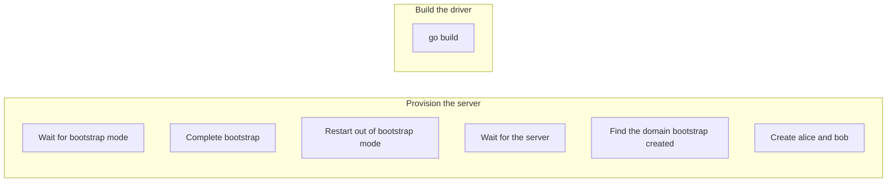
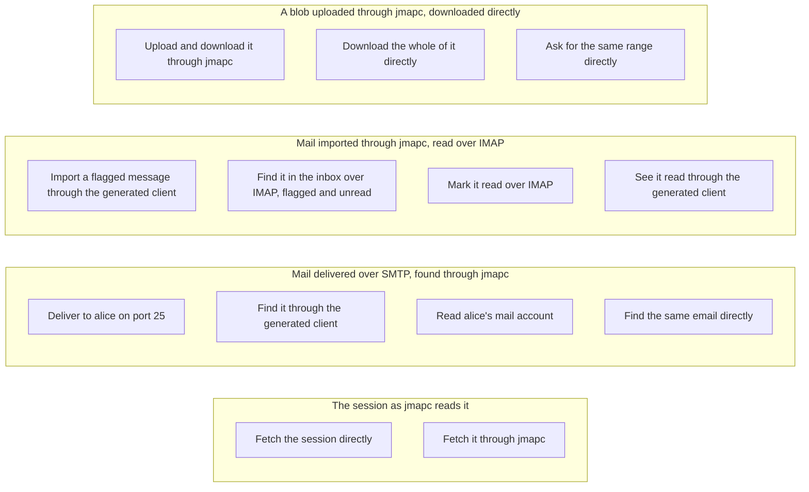

# jmapcの開発

jmapc自体の作業は、ほとんどが2つのコマンドで足ります。
1つはテストを走らせ、もう1つはカタログから生成されるものを作り直します。
CIが最初に実行するのもこの2つです。

```
go test ./...        # サーバなしで動くものすべて
go generate ./...    # ランタイムの型と、全言語のサンプルクライアントを再生成する
```

サンプルは言語ごとに3度生成され、`example/client`、`example/rust/src/jmap_client`、`example/ts`に出力されます。
残る2つがコンパイルできるかどうかはGoのテストでは分からないので、CIはRustに`cargo fmt --check`と`cargo test`を、TypeScriptに`tsc --strict`を実行します。
どちらにも生成コードと並ぶ手書きの検査があり、スタブを相手にランタイムを動かします。
ヘッダが送られること、認証がそれに優先すること、セッションがキャッシュされること、そして200を返しながら拒否を含む`/set`がやはりエラーになることを確かめます。

スキーマも同じやり方で、同じ理由から検証します。
バリデータがexampleのリクエストを受け入れ、スキーマが捕まえると主張する間違いを拒むかどうかは、Goのテストには言えません。
`example/schema/check.mjs`が、その時点のカタログから書き出したスキーマに対してバリデータを実行します。

ここでジェネレータをソースから実行しているのは、このリポジトリがジェネレータの居場所だからです。

ここまでのテストは、生成コードをスタブに対して動かします。
スタブは、テストが期待するとおりにサーバとして応答するものです。
`e2e/`は、実際のサーバであるStalwartをコンテナで動かし、それに対して実行します。

```
e2e/run.sh
```

docker、Go、[probe](https://github.com/linyows/probe)がPATHにある必要があります。
コンテナを起動し、Stalwartをbootstrap modeから抜けさせ、アカウントを2つ作ってから、`e2e/workflow.yml`のシナリオを実行します。
各シナリオは、jmapcを通して何かをしたあと、jmapcを通らない経路でそれを確かめます。
jmapcが読んだsessionを直接取得したものと比べ、SMTPで配送したメールを生成クライアントが見つけられるかを確かめます。
jmapcで取り込んだメールのフラグをIMAPで読み、IMAPで付けたフラグをjmapcで読みます。
jmapcでアップロードしたblobを、直接ダウンロードしたものと比べます。
jmapc側を受け持つのは`e2e/driver`で、`e2e/requests`から生成したクライアントを呼び、結果をJSONで出力します。

準備では、サーバの設定とドライバーのビルドを並行して行います。



シナリオは互いに独立していて、並行して実行されます。



2つ目の図は`probe dag --mermaid e2e/vars.yml,e2e/workflow.yml`で、1つ目は`e2e/setup.yml`について同じコマンドで出力したものです。
ジョブやステップを足したら、出力し直してください。

`E2E_KEEP=1`を指定しない限り、終わるとコンテナは削除されます。
Stalwartのリリースは`e2e/run.sh`で固定しています。
Stalwartはマイナーバージョンの間で設定の形を変えるので、新しいバージョンへの移行は、そこを意図して書き換える変更として行います。

ランタイムの型とサンプルのクライアントはコミットされていて、それらをカタログが今生成する結果と比較するテストがあります。
データモデルを変えたのに再生成し忘れると、見逃されるのではなくビルドが失敗します。
CIでは同じ検証に加えて、gofmt、go vet、govulncheckを実行します。

リリースは、変更がmainに入ったあとにタグをpushして作ります。
リリースノートは[CHANGELOG.md](https://github.com/linyows/jmapc/blob/main/CHANGELOG.md)のそのタグの節で、何が変わったかを、利用側にとっての意味でグループ分けし、破壊的変更を先頭に置いて書きます。
節はタグより先に書いてください。
対応する節がないタグはリリースを失敗させます。空の本文で公開するよりよいからです。

各項目は、どれだけ長くなっても1行で書きます。
GitHubはリリース本文を、渡された改行のまま表示します。
80桁で折り返した段落は、リリースページでも80桁で改行された段落になります。
