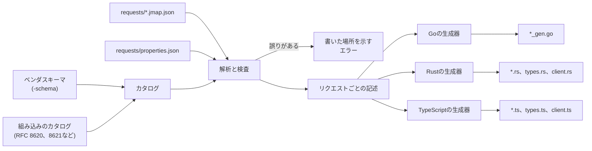
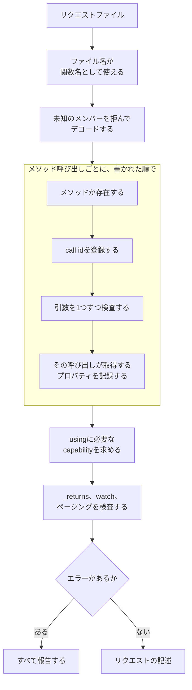
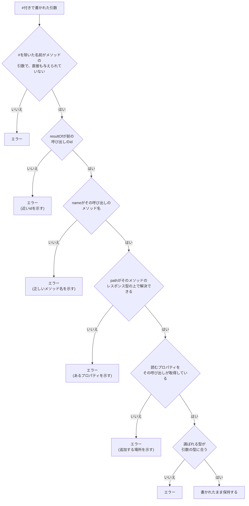

# jmapcの仕組み

jmapcは、sqlcと同じ意味でのコンパイラです。
ソースはリクエストファイルで、jmapcはそれをJMAPのデータモデルに照らして検査し、Go、Rust、TypeScriptのクライアントを出力します。
処理は3段階に分かれます。
リクエストを解析して検査し、通ったものをリクエストごとに1つの記述にまとめ、選んだ言語の生成器がその記述からコードを書きます。

## カタログ

jmapcが対応する仕様の型とメソッドは、Goのデータとしてjmapc自身に書き込まれています。
Emailとそのプロパティ、`Email/get`の引数とレスポンス、フィルタ条件が取るプロパティなどです。
これを**カタログ**と呼び、以下の検査はすべてカタログへの問い合わせとして行われます。

`-schema`で[ベンダスキーマ](extensions.md)を渡すと、リクエストを読む前に、その型とメソッドが同じカタログに加わります。
加わったあとは標準の型と区別されないので、ベンダ拡張に対するリクエストも、Emailに対するリクエストとまったく同じように検査されます。

Goパッケージ`github.com/linyows/jmapc`のランタイムの型も、このカタログから生成しています。
そのため、生成されたクライアントがデコードに使う型と、検査が照らし合わせた型が食い違うことはありません。

## 解析と検査

リクエストファイルは1つずつ解析します。
メソッド呼び出しは書かれた順に読み、読むたびに検査します。

引数の検査では、まずその引数がメソッドの取る引数の中にあるかを探し、次に値をその引数の型と照らし合わせます。
照合は値の内側まで行います。
フィルタは検索対象の型の条件と、`PatchObject`は更新されるレコードと、`properties`はデータ型のプロパティと照らし合わせます。
値の代わりに書いた`{{name}}`は生成される関数のパラメータになり、その位置が求める型を持ちます。
同じパラメータを2か所で使うなら、両方で型が一致している必要があります。
検査の一覧は[検証](verification.md)にあります。

誤りが見つかっても、そのファイルの検査は止めません。
エラーはすべて集め、書いた場所と、あれば修正の候補を添えて報告します。
jmapcはすべてのファイルを読み終えてから失敗するので、1回の実行で全ファイルの誤りが報告されます。

### back reference

back referenceは名前が`#`で始まる引数で、値を前の呼び出しの結果から受け取ります。
back referenceが正しいかどうかはほとんどが3つの文字列の値で決まるため、カタログに照らした検査がもっとも役に立つ箇所です。

「前の」呼び出しであることは、専用の検査をしていません。
call idは呼び出しを読んだ時点で登録されるので、参照を検査する時点で登録済みなのは、それより前の呼び出しと参照を含む呼び出し自身だけです。
自分自身を指す参照は別に拒否しています。

pathはJSON Pointerで、nameが示すメソッドのレスポンス型の上で、トークンを1つずつ解決します。
プロパティ名はオブジェクトのそのプロパティを、数字は配列の要素を選びます。
`*`は残りのpathを配列の各要素に適用し、結果を1段平坦化します。
そのため`/list/*/id`はidのリストのリストではなく、idのリストになります。
解決し終えた位置の型が参照の運ぶ値の型で、これが受け取る引数の型に合っている必要があります。
nullも型の一部として照らし合わせます。
`Mailbox/get`の`/list/*/parentId`は、最上位のメールボックスの分だけnullを含むので、要素がnullにならない`ids`には渡せません。
`Email/parse`が返す`threadId`のように、型ではnullにならないのにメソッドがnullで返しうるプロパティは、そのメソッドのレスポンス上ではnullになりうるものとして読みます。

データモデルだけでは見つからない誤りもあります。
Emailはどれも`threadId`を持つので、`/list/*/threadId`は`Email/get`のレスポンスの上で解決できます。
しかし`properties`で件名だけを求めた呼び出しの応答には`threadId`が含まれず、参照は何も読めません。
そこで、pathがその呼び出しのレコードから選ぶプロパティは、その呼び出しが取得するプロパティとも照らし合わせます。
`id`は、`/get`のように求められなくても返すメソッドなら通します。
`properties`を省いた呼び出しは、メソッドの既定の集合を取得するものとして扱います。多くの`/get`では型のすべてのフィールドで、ヘッダフィールドのようなフィールド以外のプロパティは含みません。`Blob/get`（`data`と`size`）、`Email/get`（`headers`と`bodyStructure`を含まない）、`Email/parse`は、それぞれ仕様が定める一覧です。`CalendarEvent/get`は`utcStart`と`utcEnd`を除くすべてのフィールドで、この2つは名指しした呼び出しにだけ返します。`bodyProperties`を省いた呼び出しは、`headers`と`subParts`を含まないボディパートを取得するものとして扱います。
解析したメールの`id`のように、何を求められてもnullで返すプロパティは、呼び出しがプロパティをどう求めていても拒否します。
参照される呼び出しは前にあって先に検査を終えているので、この時点で取得するプロパティは確定しています。

検査を通った参照は、同じ3つの文字列を持つ`ResultReference`として、そのまま生成コードに書かれます。
参照を解決するのはサーバで、生成コードは実行時に参照を処理しません。

## リクエストの記述

検査を通ったものは、リクエストごとに1つの記述になります。
生成器が読むのはこの記述だけです。
記述には、検査済みの引数を持つ呼び出しの並び、パラメータとその型、使うcapability、結果を返す呼び出し、watchが追う呼び出しやページャが進める呼び出し、作成id、各呼び出しが取得するプロパティが入っています。

リクエストを読む処理はここで1度だけ行い、3つの生成器がその結果を共有します。
Go、Rust、TypeScriptで異なるのは、同じ記述をどう書き出すかだけです。

## 生成

リクエストは1つにつき1つのファイルになります。
ファイルには、リクエストの名前を持つ関数、パラメータの型、リクエストが求めたプロパティだけを持つレスポンスの型が入ります。
`properties`をパラメータや結果参照で与える呼び出しは、すべてのプロパティがoptionalなランタイムの型で応答を受けます。
ただし`Email/parse`のように型とは違う形でプロパティを返すメソッドと、`bodyProperties`を絞る呼び出し（`Email/get`は既定で絞ります）では、呼び出し専用の型を作ります。
その型では、`/get`が求めなくても返すidを除いてすべてのプロパティがoptionalで、メソッドがnullで返すプロパティは持ちません。
`CalendarEvent/parse`のように、そうしたメソッドがすべてのプロパティを取得する呼び出しも同じ型になります。ファイルから読んだ予定は、ファイルにあるプロパティしか持たないからです。
`properties`を省いた`CalendarEvent/get`も同じで、その型は`utcStart`と`utcEnd`を持ちません。
リクエストが求めていれば、watchのループやページャも入ります。
リクエストのファイルと並んで、プロジェクトが[プロパティ集合](properties.md)を定義していればその型のファイルが、加えて全リクエストをサーバに対して検証する関数が出力されます。
RustとTypeScriptでは、取り込めるjmapcのパッケージがないので、データモデルの型とランタイムも一緒に出力します。
Goはどちらも`github.com/linyows/jmapc`から取り込みます。

何かを書き出す前に、生成器は衝突する名前を拒否します。
ファイル名が大文字と小文字の違いしかない2つのリクエストや、プロパティ集合や検証用の関数と同じ名前のリクエストです。

`jmapc generate`はファイルを出力先に書き、もう存在しないリクエストから以前に生成したファイルを削除します。
ほかのコマンドも同じ段階を実行し、書き込む前で止まります。

| コマンド | 解析と検査 | 生成 | 書き込み |
|---|---|---|---|
| `jmapc generate` | する | する | する |
| `jmapc generate -check` | する | する | しない。ディスク上のファイルと比べる |
| `jmapc validate` | する | 衝突する名前を見つけるため、メモリ上でする | しない |
| `jmapc validate -session` | する | メモリ上でする | しない。各リクエストをサーバに対して検査する |

サーバに対する検査は、カタログに問い合わせない唯一の段階です。
sessionを取得し、各リクエストをそのサーバが受け付けると言っている範囲と照らし合わせます。
対象は、サーバが提供するcapability、持っているアカウント、1回のリクエストで受け付ける呼び出しとオブジェクトの数です。
これらは仕様がサーバに任せている事柄なので、カタログには情報がありません。
